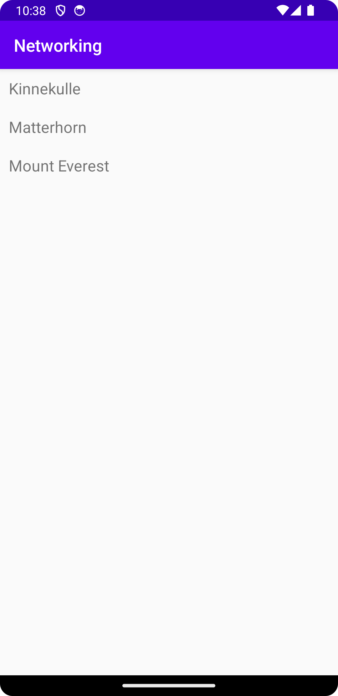

# Rapport

Har skapat en RecyclerView som ska visa upp namn på olika berg som hämtas in via en URL.
För att kunna ta emot datan i URL:en har en Mountain-klass skapats som endast tar emot namnet på 
bergen, internetåtkomst har tillåtits, och för att kunna visa datan i RecyclerView har en 
RecyclerViewAdaper skapats. Då datan inte kan visas upp direkt, måste datan parsas ut vilket görs 
genom Gson som parsar ut JSON-datan från URL:en. I kodexemplet nedan möjliggörs parsning av 
JSON-datan ia Gson, och nedanför detta ser vi klassen som hanterar och tar emot information (namn) 
om bergen. 

```
@Override
    public void onPostExecute(String json) {
        Log.d("MainActivity", json);
        Gson gson = new Gson();
        Type type = new TypeToken<List<Mountain>>() {}.getType();
        mountainArrayList = gson.fromJson(json, type);
    }
    
/----------/

public class Mountain {
    @SerializedName("name")
    public String name;
    public Mountain(String name){
        this.name=name;
    }
    public String getName(){
        return name;
    }
    public void setName(String name){
        this.name=name;
    }
    @Override
    public String toString(){
        return name;
    }
    public String getTitle(){
        return name;
    }
}   
 
```

Bilder läggs i samma mapp som markdown-filen.



Läs gärna:

- Boulos, M.N.K., Warren, J., Gong, J. & Yue, P. (2010) Web GIS in practice VIII: HTML5 and the canvas element for interactive online mapping. International journal of health geographics 9, 14. Shin, Y. &
- Wunsche, B.C. (2013) A smartphone-based golf simulation exercise game for supporting arthritis patients. 2013 28th International Conference of Image and Vision Computing New Zealand (IVCNZ), IEEE, pp. 459–464.
- Wohlin, C., Runeson, P., Höst, M., Ohlsson, M.C., Regnell, B., Wesslén, A. (2012) Experimentation in Software Engineering, Berlin, Heidelberg: Springer Berlin Heidelberg.
